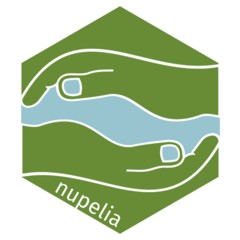

<!-- README.md is generated from README.Rmd. Please edit that file -->

# nupelia <a href="https://nupelia.github.io/nupelia/"></a>

<!-- badges: start -->

[](https://app.codecov.io/gh/Nupelia/nupelia?branch=master)
[](https://github.com/Nupelia/nupelia/actions/workflows/R-CMD-check.yaml)
<!-- badges: end -->

Pacote para uso do Núcleo de Pesquisas em Limnologia, Ictiologia e
Aquicultura (Nupélia). Pode ser utilizado como auxílio para relatórios
do PELD - sítio 6.

Esse pacote foi criado por Bruno H. Mioto Stabile

## Instalação

Você pode instalar esse pacote pelo github utilizando o código:

``` r
# install.packages("devtools")
devtools::install_github("Nupelia/nupelia")
```

## Uso

## Funções PELD

Antes de começar, é necessário ter o arquivo de uma tabela do PELD com o
seguinte formato:

**(É necessário que o nome das colunas seja escrito dessa forma)**

| especie                   | lab | lfe | rio |
|:--------------------------|----:|----:|----:|
| Acestrorhynchus lacustris |   7 |     |   6 |
| Aequidens plagiozonatus   |   1 |   1 |     |
| Ageneiosus inermis        |   8 |   4 |   7 |
| Ageneiosus ucayalensis    |   1 |     |     |
| Astyanax lacustris        |  16 |  38 |  12 |

### Função `peld_abrevia_especie()`

Essa função tem como objetivo abreviar o gênero em nomes científicos
para facilitar a leitura posterior. Caso os nomes abreviados fiquem
idênticos (como A. lacustris para Acestrorhynchus lacustris e Astyanax
lacustris, por exemplo), são utilizadas as 3 primeiras letras do gênero.

A tabela apresentada acima ficaria da seguinte forma:

``` r
tabela_peld_exemplo2 <- tabela_peld_exemplo %>%
  peld_abrevia_especie()

tabela_peld_exemplo2
```

| especie          | lab | lfe | rio |
|:-----------------|----:|----:|----:|
| Ace. lacustris   |   7 |     |   6 |
| A. plagiozonatus |   1 |   1 |     |
| A. inermis       |   8 |   4 |   7 |
| A. ucayalensis   |   1 |     |     |
| Ast. lacustris   |  16 |  38 |  12 |

### Função `peld_abund_rel()`

Essa função permite calcular a abundância relativa de espécies, seja
considerando todos os subsistemas ou algum em específico

Existem alguns argumento nessa função:

-   `dados`: A tabela de dados
-   `subsistema`: O subsistema indicado para análise. Pode ser “lab”,
    “lfe”, “rio” ou “geral” caso seja para todos. O padrão é “geral”.
-   `porcentagem_corte`: A porcentagem da abundância relativa utilizada
    como corte para espécies. Espécies com porcentagem menor serão
    agrupadas em **“Outros”**. 2 por padrão.

``` r
tabela_peld_exemplo2 %>% 
  peld_abund_rel()
```

| especie        | total_sp | total_geral | abund_rel_porcentagem |
|:---------------|---------:|------------:|----------------------:|
| Ast. lacustris |       66 |         101 |                 65.35 |
| A. inermis     |       19 |         101 |                 18.81 |
| Ace. lacustris |       13 |         101 |                 12.87 |
| Outros         |        3 |         101 |                  2.97 |

Caso queira fazer para um subsistema específico, utilize o argumento
`subsistema`:

``` r
tabela_peld_exemplo2 %>% 
  peld_abund_rel(subsistema = "lab")
```

| especie          | subsistema | total_sp | total_geral | abund_rel_porcentagem |
|:-----------------|:-----------|---------:|------------:|----------------------:|
| Ast. lacustris   | lab        |       16 |          33 |                 48.48 |
| A. inermis       | lab        |        8 |          33 |                 24.24 |
| Ace. lacustris   | lab        |        7 |          33 |                 21.21 |
| A. plagiozonatus | lab        |        1 |          33 |                  3.03 |
| A. ucayalensis   | lab        |        1 |          33 |                  3.03 |

### Função `peld_riqueza()`

Utilize essa função para calcular a riqueza (S) em cada subsistema.

``` r
tabela_peld_exemplo2 %>% 
  peld_riqueza()
```

| subsistema | riqueza |
|:-----------|--------:|
| lab        |       5 |
| lfe        |       3 |
| rio        |       3 |

### Função `peld_shannon()`

Essa função retorna o índice de diversidade Shannon (H’) para cada
subsistema.

``` r
tabela_peld_exemplo2 %>% 
  peld_shannon()
```

| subsistema |   shannon |
|:-----------|----------:|
| lab        | 1.2353463 |
| lfe        | 0.4176315 |
| rio        | 1.0512435 |

### Função `peld_equitabilidade()`

Também é possível calcular o índice de Equitabilidade de Pielou (J’)
para cada subsistema.

``` r
tabela_peld_exemplo2 %>% 
  peld_equitabilidade()
```

| subsistema |     equit |
|:-----------|----------:|
| lab        | 0.3533086 |
| lfe        | 0.1110368 |
| rio        | 0.3265872 |

### Tabela de locais de amostragem do PELD

O pacote possui um dataset com dados de todos os locais de amostragem já
utilizados no PELD. Para uso, basta utilizar `peld_locais`.

Serão retornados 36 ambientes, com as seguintes variáveis:

-   `ambiente_tipo`: Tipo do ambiente
-   `ambiente_nome`: Nome do ambiente
-   `ambiente_codigo`: Codigo do ambiente
-   `coordenadas`: Coordenadas do ambiente, no padrão 00º’00.00”S,
    00º00’00.00”W
-   `desc`: A descrição do ambiente

``` r
peld_locais
#> # A tibble: 36 x 5
#>    ambiente_tipo ambiente_nome            ambiente_codigo coordenada       desc 
#>    <chr>         <chr>                    <chr>           <chr>            <chr>
#>  1 Lagoa Fechada Lagoa do Ventura         LVEN            "22º51'23.7\"S,~ Lago~
#>  2 Lagoa Fechada Lagoa Zé do Paco         LZEP            "22º50'3.72\"S,~ Lago~
#>  3 Lagoa Fechada Lagoa Jacaré             LJAC            "22º47'2.04\"S,~ Lago~
#>  4 Lagoa Fechada Lagoa do Cervo           LCER            "22º46'29.58\"S~ Lago~
#>  5 Lagoa Fechada Lagoa Capivara           LCAP            "22º47'56.52\"S~ Com ~
#>  6 Lagoa Fechada Lagoa Fechada            LFEC            "22º42'37.92\"S~ Lago~
#>  7 Lagoa Fechada Lagoa Pousada das Garças LPGA            "22º42'1.14\"S,~ Lago~
#>  8 Lagoa Fechada Lagoa Traíra             LTRA            "22º44'45.6\"S,~ Pequ~
#>  9 Lagoa Fechada Lagoa do Aurélio         LAUR            "22º41'34.68\"S~ Pequ~
#> 10 Lagoa Fechada Lagoa Pousada            LPOU            "22º44'41.76\"S~ Loca~
#> # ... with 26 more rows
```
